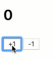
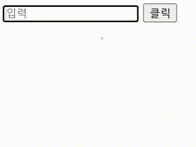
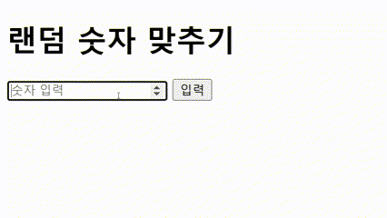

# JavaScript 학습 피드백
**이 문서는 JavaScript 를 공부하면서 부족했던 점과 보완할 내용을 정리하는 문서입니다.**


---
## 실습 프로젝트 피드백 및 개념 보완

### 1. 카운터 
**기능 :** 버튼을 클릭하면 숫자가 증가/감소

관련 문서: [Counter](/JavaScript-Docs/Web_Interaction/Counter.md)

### 부족했던 개념 및 피드백 
> 1. [화살표 함수](/JavaScript-Docs/Basics/function.md/#화살표-함수) : 화살표 기준 좌측에는 함수의 파라미터, 우측에는 코드 블록     
> 사용법 : `const add = ( 파라미터 ) => { 코드 }`

> 2. [`getElementById`](/JavaScript-Docs/Web_Interaction/Counter.md/#documentgetelementbyid): HTML 문서에서 특정 id 값을 가진 요소를 가져오는 역할        
> 사용법 : `const number = document.getElementById("id명");`

> 3. [`onClick`](/JavaScript-Docs/Web_Interaction/Counter.md/) : 해당 요소를 클랙했을 때 실행할 동작을 설정     
> 사용법 : `요소.onclick = () => { 코드 }`

> 4. [`parseInt()`](/JavaScript-Docs/Web_Interaction/Counter.md/): 문자열을 숫자로 변환해주는 함수   
> 사용법: 두번째 자리에 `10`이 들어가는데 그 의미는 10진수를 출력하라는 의미

> 5. `innerText` :  HTML 요소 내부의 텍스트 값을 가져옴     
> 사용법: `변수.innerText`

### 피드백
1. `getElementById` 의 뜻과 사용법을 정확히 인지하지 못했음
2. `parseInt()` 함수의 응용이 미숙했음


### 주요 코드 (요약)
```js
// HTML 문서에서 특정 id 값을 가진 요소를 가져옴 
const number  = document.getElementById("number"); 
const increase = document.getElementById("increase"); 
const decrease = document.getElementById("decrease"); 

// const number = document.getElementById("HTML id 명");
// - " " 부분 HTML id를 넣어 가져옴

// 해당 요소를 클릭하면 실행할 동작을 설정
increase.onclick = () => {
    const sum = parseInt(number.innerText, 10); 
    number.innerText = sum + 1; 
};

decrease.onclick = () => {
    const sum = parseInt(number.innerText, 10); 
    number.innerText = sum - 1;
};

// parseInt(number.innerText, 10);
// - number의 텍스트 값을 가져와 숫자로 변환 (10진수 기준)
// - 기존의 innerText 값이 문자열이므로 변환이 필요함

// number.innerText = sum + 1; 
// - 변환된 숫자 값에 1을 추가한 후 다시 HTML 요소에 반영
// - 감소도 같음
```

### 실행 화면 및 코드


**[JavaScript](/code/Counter/Counter.js)**

**[HTML](/code/Counter/index.html)**

--- 

### 2. 배경색 변경

**기능 :** 버튼을 클릭하면 배경색이 변경됨

관련 문서: [Style](/JavaScript-Docs/Web_Interaction/DOM-Event-Basics.md#style)

### 부족했던 개념 
> 1. `Math.floor` : 숫자를 내림하여 정수로 만드는 함수     
> 사용법 : `console.log(Math.floor(4.9)); // 4  (소수점 버림)`

### 피드백 
1. `Math` 함수 종류를 더 찾아보기


### 주요 코드 (요약)
```js
const backcolor = document.getElementById("backcolor"); // 버튼 요소 가져오기

backcolor.addEventListener("click", () => {
  const color = ["red", "green", "blue", "yellow"]; // 색상 배열

  const random = Math.floor(Math.random() * color.length); // 0 ~ 3 사이의 랜덤 숫자 생성

  document.body.style.backgroundColor = color[random]; // 랜덤 색상 적용
});
```

### 실행 화면 및 코드


**[JavaScript](/code/randomcolor/backrandomcolor.js)**

**[HTML](/code/randomcolor/index.html)**

--- 

### 3. To-Do List 

**기능 :** 할 일 추가 및 삭제

관련 문서: [Dom](./Web_Interaction/DOM-Event-Basics.md#03-dom-event-basics)

### 부족했던 개념 

> 1. `innerText` :  HTML 요소 내부의 텍스트 값을 가져옴     
> 사용법: `변수.innerText`

> 2. `.value` : `<input>`, `<textarea>` 같은 입력 요소에서 사용자가 입력한 값을 가져옴    
> 사용법 : `input.value`

> 3. `addEventListener` : 여러개의 이벤트 핸들러를 등록할 수 있다.    
> 사용법 : `but.addEventListener("click", () => {}`

### 피드백
1. `innerText` 를 사용하면 기존의 `button` 이 `innerText` 로 인한것인지를 몰랐음
2. `addEventListener` 는 여러개의 이벤트 핸들러가 등록이 가능하다는 것을 까먹고 1개의 이벤트 핸들러만 사용하고 있었음


### 주요 코드 (요약)
```js
// HTML 요소 선택
const inputField = document.getElementById("in"); // 입력창 (할 일 입력)
const addButton = document.getElementById("but"); // 추가 버튼
const todoList = document.getElementById("ui"); // 할 일 목록 (ul)

// "추가" 버튼 클릭 이벤트
addButton.addEventListener("click", () => {
  if (inputField.value.trim() === "") return; // 빈 값 방지

  // 새로운 리스트 아이템 (li) 생성
  const listItem = document.createElement("li");
  listItem.innerText = inputField.value; // 입력한 값 적용

  // 삭제 버튼 생성
  const deleteButton = document.createElement("button");
  deleteButton.innerText = "삭제";
  deleteButton.onclick = () => listItem.remove(); // 삭제 기능 추가

  // 리스트 아이템(li)에 삭제 버튼 추가 후, 전체 목록에 추가
  listItem.appendChild(deleteButton);
  todoList.appendChild(listItem);

  inputField.value = ""; // 입력창 초기화
});
```

### 실행 화면 및 코드



**[JavaScript](/code/ToDoList/todoList.js)**

**[HTML](/code/ToDoList/index.html)**

---

### 4. 랜덤 숫자 맞추기

**기능 :** 랜덤 숫자를 출력하여 정답을 맞춤

관련 문서: [DOM 이벤트](./Web_Interaction/DOM-Event-Basics.md)

### 부족했던 개념 
> 1. `isNaN` : 주어진 값이 `NaN (Not a Number)` 인지 확인     
> 사용법 : `isNaN(userInput)`

> 2. `parseInt()` : 문자열을 숫자로 변환해주는 함수   
> 사용법 : `parseInt(inpnum.value)`

### 피드백
1. `parseInt()` 의 사용법을 인지하고 있었지만 내가 입력한 값을 숫자로 변환하는 용도로 사용할 수 있는지를 모르고 있었음
2. `isNaN` 함수를 몰라 공백만 입력했을 때 처리하는 법을 쉽게하는 법을 몰랐음

### 주요 코드 (요약)
```js
const inpnum = document.getElementById("inpnum"); // 숫자 입력
const numbut = document.getElementById("numbut"); // 버튼
const text = document.getElementById("text");

const randomnumber = Math.floor(Math.random() * 100) + 1; // 랜덤 값 출력 1 ~ 100
console.log(randomnumber);

numbut.addEventListener("click", () => {
  const userInput = parseInt(inpnum.value); // 입력 값을 숫자로 변환

  if (isNaN(userInput)) {
    text.innerText = " 숫자를 입력해주세요!";
    return;
  }

  if (userInput === randomnumber) {
    text.innerText = "정답입니다!";
    inpnum.value = "";
  }
  else if(userInput > randomnumber)
    text.innerText = "더 낮은 숫자를 입력하세요!";
  else
    text.innerText = "더 높은 숫자를 입력하세요!";
});
```

### 실행 화면 및 코드


**[JavaScript](/code/randomnumber/randomnumber.js)**

**[HTML](/code/randomnumber/index.html)**


---