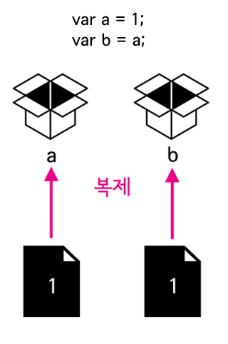
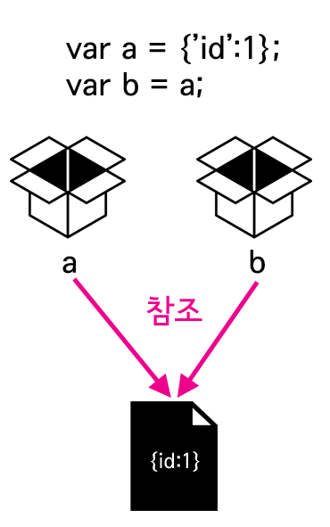

# day24

## 복제
```js
var a = 1;
var b = a;
b = 2;
console.log(a); // 1
```
결과는 당연하다. 값을 변경한 것은 변수 b이기 때문에 변수 a에 담겨있는 값은 그대로여야한다. 변수 b의 값에 변수 a의 값이 복제된 것



## 참조
```js
var a = {'id': 1};
var b = a;
b.id = 2;
console.log(a.id); // 2
```

아래 두 개의 구문의 차이점을 생각해보자.


```js
a = 1;

a = {'id': 1};
```
전자는 데이터형이 숫자이고 후자는 객체다. 숫자는 원시 데이터형(기본 데이터형, Primitive Data Types)이다. 자바스크립트에서는 원시 데이터형을 제외한 모든 데이터 타입은 객체이다. 객체를 다른 말로는 참조 데이터 형(참조 자료형)이라고도 부른다. 기본 데이터형은 위와 같이 복제 되지만 참조 데이터형은 참조된다. 모든 객체는 참조 데이터형이다. 이를 그림으로 나타내면 아래와 같다.



## 함수
그럼 일종의 변수할당이라고 할 수 있는 메소드의 매개변수는 어떻게 동작하는가를 살펴보자. 조금 복잡하므로 꼼꼼하게 살펴봐야 한다. 예제를 보자.

다음은 원시 데이터 타입을 인자로 넘겼을 때의 동작 모습이다.

```js
var a = 1;
function func(b){
    b = 2;
}
func(a);
console.log(a); // 1
```

다음은 참조 데이터 타입을 인자로 넘겼을 때 동작하는 장면이다. 

```js
var a = {'id':1};
function func(b){
    b = {'id':2};
}
func(a);
console.log(a.id);  // 1
```

함수 func의 파라미터 b로 전달된 값은 객체 a이다. (b = a) b를 새로운 객체로 대체하는 것은 (b = {'id':2}) b가 가르키는 객체를 변경하는 것이기 때문에 객체 a에 영향을 주지 않는다.
```js
var a = {'id':1};
function func(b){
    b.id = 2;
}
func(a);
console.log(a.id);  // 2
```
파라미터 b는 객체 a의 레퍼런스다. 이 값의 속성을 바꾸면 그 속성이 소속된 객체를 대상으로 수정작업을 한 것이 되기 때문에 b의 변경은 a에도 영향을 미치게 된다. 
