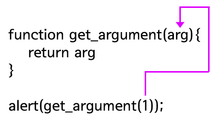

# day4

## 함수
하나의 로직을 재실행 할 수 있도록 만들어준다. 코드의 재사용성을 높여준다.

## 함수의 형식
function 뒤에 함수 이름이 오고, 소괄호 안에는 인자라는 값이 차례로 들어온다. 이 인자의 값은 함수를 호출할 때 함수의 로직으로 전달된 변수다. 생략이 가능하며, 호출 했을 때 실행하게 될 부분이 중괄호 안쪽에 들어감.
```JavaScript
function 함수명 ( [인자...] [, 인자]) {
    코드 
    return 반환값
}
```

## 함수의 호출
다음 예제를 보자. 이 함수의 이름은 numbering이고, 내용은 0부터 9까지를 화면에 출력한다.

```JavaScript
function numbering() {
    i = 0;
    while(i < 10) {
        document.write(1);
        i += 1;
    }
}

numbering(); // 함수 호출
```

결과는 아래와 같다.

```JavaScript
0123456789
```

## 입력과 출력
함수의 핵심은 입력과 출력이다. 입력된 값을 연산해서 출력하는 것이 함수의 기본적인 역할이기 떄문이다.

## return
함수 내에서 사용한 `return`은 `return` 뒤에 따라오는 값을 함수의 결과로 반환하며, 동시에 함수를 종료시킨다.

```JavaScript
function get_member1(){
    return 'egoing';
}

alert(get_member1()); // 결과 : egoing
```

결과를 반환시키기도 하지만 함수를 중지시키는 역할도 한다. 이 코드를 실행 시키면 k8805 와 sorialgi를 출력하지 않는다. 그 이유는 return 'egoing'을 실행한 후 함수가 종료되었기 때문이다.
```JavaScript
function get_member() {
    return 'egoing';
    return 'k8805';
    return 'sorialgi';
}

alert(get_member());
```

## 인자
함수로 유입되는 입력 값을 의미하는데, 어떤 값을 인자로 전달하느냐에 따라 함수가 반환하는 값, 메소드의 동작방법을 다르게 할 수 있다.

```JavaScript
function get_argument(arg) {
    return arg;
}

alert(get_argument(1)); // 결과 : 1
```

아래의 사진과 같이 동작한다.


## 복수의 인자
여러개의 입력 값을 받고 싶다면  인자를 여러개 사용하면 된다

```JavaScript
function get_arguments(arg1, arg2) {
    return arg1 + arg2;
}

alert(get_arguments(10, 20)); // 결과 : 30
```

아래와 사진과 같이 동작한다.


## 함수의 다양한 정의 방법
아래 방법은 함수를 정의하는 또 다른 방법이다.

```JavaScript
var numbering = function (){
    i = 0;
    while(i < 10){
        document.write(i);
        i += 1;
    }   
}
numbering();
```
